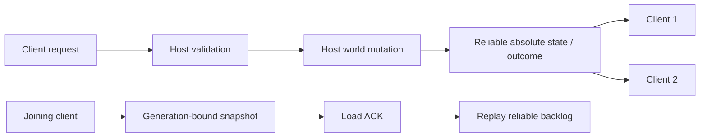

# Oxygen Not Included Together

面向《Oxygen Not Included》的同步多人联机 Mod。当前发布版以 **U59-740622-S** 为游戏基线，版本为 **1.0.0**，网络协议版本为 **9**。

## 当前状态

- [F] 本体与 **Spaced Out!** 是当前运行时验收范围。
- [F] Frosty Planet Pack、Bionic Booster Pack、Prehistoric Planet Pack、Neutronium Cosmetics Pack、Aquatic Planet Pack 已有对应同步代码并通过编译，但当前机器没有这些 Steam 权益，因此没有运行时验收。
- [F] 客户端在建造、日程、优先级、技能、分配与多项 DLC 交互上发送请求；宿主验证请求、修改世界，再广播绝对状态或结果。
- [F] 加入流程使用带 generation/token 的存档快照屏障；快照期间的可靠状态进入 backlog，客户端加载完成并确认后才恢复实时流。
- [F] 游戏中断线会按指数退避重试五次；重新握手后客户端请求新的完整快照，再通过 loading proof 回到实时流。该恢复路径不复用可能已漂移的本地世界。
- [F] 宿主只解除由联机会话取得所有权的自动暂停；同步期间玩家手动选择暂停后，barrier 完成不会覆盖该选择。
- [F] LAN 使用 Riptide UDP；大存档优先走相邻 TCP 端口，失败时回到分块 UDP 传输。
- [F] 协议握手要求游戏构建、协议版本、packet registry fingerprint、Mod 版本、主 DLL SHA-256、DLC 集合与启用 Mod fingerprint 全部一致。
- [F] 长时验证将状态拆为 `grid / entity / storage / world / rocket` 五个域；每段先比较 raw hash，再通过宿主权威 keyframe 修复并等待 ACK，最后比较 post-keyframe hash。
- [F] 实体生命周期使用单调 revision 与 tombstone；绑定 claim 在失败时回滚 NetId、journal、位置和激活状态，待销毁对象不能重新取得权威 NetId。
- [F] 仓库仍保留 dedicated-server 原型，但本次发布包不包含它。



## 安装

见 [INSTALL.md](INSTALL.md)。正式版只通过 Steam Workshop 发布；所有参与者必须使用同一工坊版本，不能混用 Workshop 版与本地开发版。

## 使用

1. 在游戏的 Mods 页面为当前 DLC 启用 `Oxygen Not Included Together`，随后重启游戏。
2. 从主菜单打开 Multiplayer 界面。
3. Steam 联机由宿主创建 lobby；LAN 默认监听 UDP `8080`，存档 TCP 传输使用 `8081`。
4. 客户端使用宿主地址和相同端口加入。

[F] 两台机器必须使用相同游戏构建、DLC 选择、启用 Mod 集合和 ONI Together DLL。握手不提供兼容性绕过开关。

macOS 不需要 GUI 自动化即可启动游戏。本机可交给 Steam 客户端启动，第二台 Mac 可通过 SSH 调用 Launch Services：

```bash
/usr/bin/open 'steam://run/457140'
ssh user@host "open -a 'Oxygen Not Included'"
```

## 调试与验证

Debug 构建提供三条确定性入口：

- `Shift+F2`：打开测试菜单。
- `Shift+F3`：发现并运行全部游戏内单元测试。
- `Shift+F4`：在 `127.0.0.1:27777` 运行 Riptide 回环冒烟测试，覆盖连接、发送者绑定、序列化和派发链。

[F] 2026-07-18 的两台实机 Debug 全测结果均为 539 项：513 项通过、0 项失败、26 项因缺少对应运行态而跳过。

[F] 最新源码 Debug 构建为 59 warnings、0 errors；Release 构建为 60 warnings、0 errors。两台机器的 Riptide 回环测试均通过，Release 包也都已原生启动到主菜单，没有 ONI Together error/exception。

[F] 禁用 ONI MCP Server 后，原生双机 soak 已跑满 21 段、37,800 tick。21 次 post-keyframe 比较的五个域全部一致，最终记录为 `postMismatchSeen=False`、`keyframeApplyFailureSeen=False`、`postKeyframeEqual=True`，生命周期 missing/unexpected/tombstoned-live/unassigned 全为 0。

[F] 汇总标签 `COMPLETE_WITH_DIVERGENCE` 记录的是 keyframe 前的 raw drift；本轮 `firstRawMismatchSample=1`，修复后的 21 次比较全部收敛。raw mismatch 是诊断信号，post-keyframe mismatch 才是发布失败。

[F] 回环测试只能证明单进程传输链工作；它不能替代两台真实机器上的加入、存档加载、断线重连和长时间模拟测试。

[F] 同一 macOS 用户下启动第二个游戏进程会共享存档、偏好、Mod 配置和 safe-mode 状态；设置独立 `HOME` 也不会改变 Unity 数据目录，因此该方式不作为双运行时验收证据。

## 构建

[F] 项目目标为 `netstandard2.1`，同一 DLL 可用于 macOS、Windows 与 Linux；单一 Workshop 内容目录同时携带三个平台的 UI asset bundle。

在 macOS 上，可用已安装游戏的 Managed assemblies 构建：

```bash
docker run --rm \
  -v "$PWD:/src" \
  -v "$HOME/Library/Application Support/Steam/steamapps/common/OxygenNotIncluded/OxygenNotIncluded.app/Contents/Resources/Data/Managed:/game:ro" \
  -w /src mcr.microsoft.com/dotnet/sdk:8.0 \
  bash -lc 'dotnet restore ONI_Together/ONI_Together.csproj && dotnet build ONI_Together/ONI_Together.csproj --no-restore -c Release -p:GameLibsFolder=/game -p:ModFolder=/tmp/oni-mod -p:SkipAssetClone=true -p:TargetGameVersion=740622'
```

构建完成后生成唯一的 Workshop 内容目录：

```bash
./scripts/package_workshop.sh
```

将 `dist/ONI_Together-workshop` 交给 Steam Library → Tools 中的 **Oxygen Not Included Uploader**；主预览图使用 `dist/ONI_Together-workshop-preview.png`。不再生成平台 zip。

## License

MIT。版权信息见 [LICENSE.md](LICENSE.md)。
